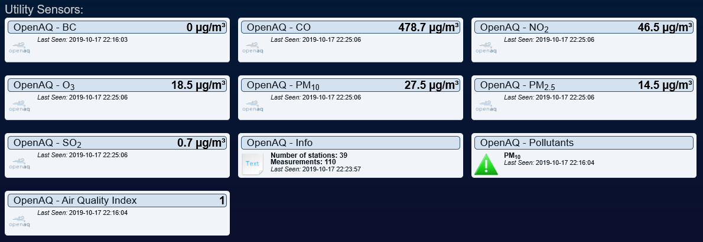

# OpenAQ
This Domoticz plugin gets the air quality at your location from https://openaq.org. 
OpenAQ is collecting data in 64 different countries and always seeking to add more. They aggregate PM2.5, PM10, ozone (O3), sulfur dioxide (SO2), nitrogen dioxide (NO2), carbon monoxide (CO), and black carbon (BC) from real-time government and research grade sources.
The plugin scans the stations nearby your location and takes the data about all the pollutants which are closest to your location.

## Parameters
| Name       | Description                                                              |
| :---       | :---                                                                     |
| **Radius** | Radius in kilometers from your location defined in Settings. Default: 10 |

Check https://openaq.org/#/map to see if a source can be found at your location.

This plugin uses the latitude and longitude as specified in Domoticz Settings - System - Location.

## Devices
| Name                 | Description                                              |
| :---                 | :---                                                     |
| **BC**               | Black Carbon                                             |
| **CO**               | Carbon Monoxide                                          |
| **NO2**   | Nitrogen Dioxide                                         |
| **O3**    | Ozone                                                    |
| **PM10**  | Particulate matter less than 10 micrometers in diameter  |
| **PM2.5** | Particulate matter less than 2.5 micrometers in diameter |
| **SO2**   | Sulfur Dioxide                                           |
| **Info**             | Information, like nearest location, number of locations  |
| **Index**            | Air Quality Index                                        |

## Air Quality Index
This alert sensor indicates the quality of the air. The upper limits below are based on information from http://www.airqualitynow.eu/about_indices_definition.php

| Pollutant            | Very low |     Low  |    Medium |     High | Very high |
| :---                 |     ---: |     ---: |      ---: |     ---: |      ---: |
| **CO**               |     5000 |     7500 |     10000 |    20000 |   > 20000 |
| **NO2**   |       50 |      100 |       200 |      400 |     > 400 |
| **O3**    |       60 |      120 |       180 |      240 |     > 240 |
| **PM10**  |       25 |       50 |        90 |      180 |     > 180 |
| **PM2.5** |       15 |       30 |        55 |      110 |     > 110 |
| **SO2**   |       50 |      100 |       350 |      500 |     > 500 |
|                      |     gray |    green |    yellow |   orange |       red |